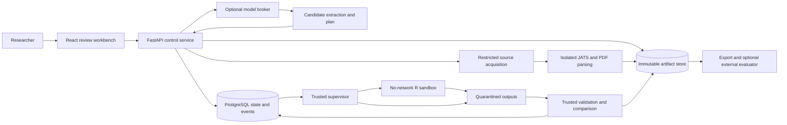
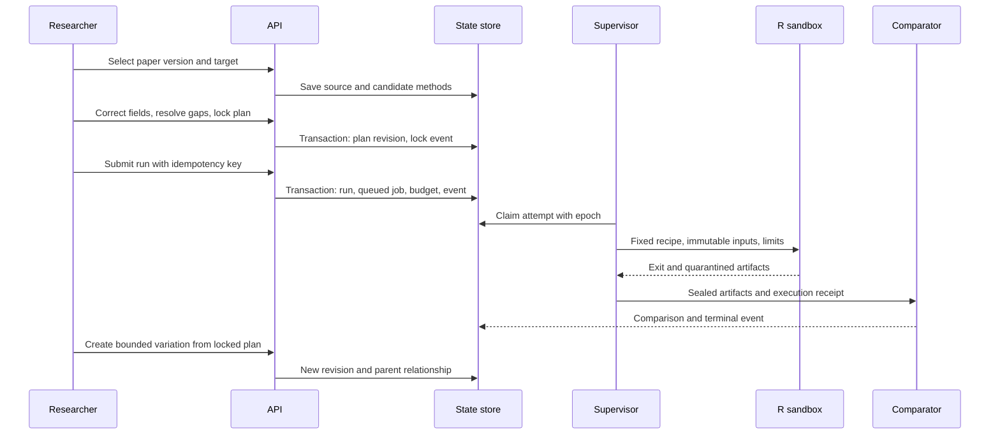
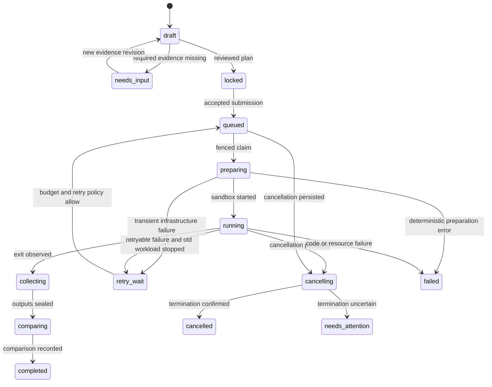
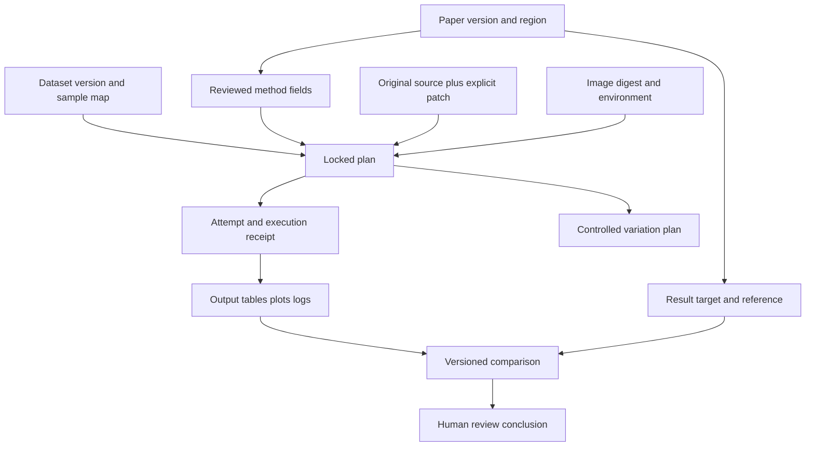

# Architecture and contracts

[Start](../README.md) · [Demo](DEMO.md) · [Backlog](IMPLEMENTATION.md) · [Verification](VERIFICATION.md)

## System shape

Use a small monorepo with a browser application, Python control service, trusted execution supervisor, and scientific recipes. Start with one local workspace, one numerical run at a time, and a curated recipe. This is a proposed design; none of the services exists yet.



The API handles short requests; experiments survive browser disconnection. Source acquisition, parsing, model inference and numerical execution have different capabilities. No component that reads arbitrary paper or repository content receives an unrestricted control-plane credential.

Loopback binding alone is not authorization. Local mode uses a per-installation session secret, SameSite/HttpOnly cookies, CSRF protection for mutations, explicit Host/Origin checks and a narrow CORS allowlist. A malicious web page must not be able to launch a job through the local API. The supervisor's private socket accepts only the controller's validated requests. Team mode replaces local identity with authenticated membership without weakening these request protections.

## Stack decisions

| Layer | Choice | Reason and alternative |
|---|---|---|
| Browser | React, TypeScript, Vite, React Router, TanStack Query, accessible component primitives | Application interaction dominates; no SEO or server rendering requirement. Next.js is viable but adds a server boundary without a clear MVP benefit. |
| Source/plots | PDF.js overlays, typed JATS reader, Plotly.js for numerical exploration; original static plots retained | Preserve source geometry and expose numerical tables. Glimma/iSEE remain export options rather than separate embedded authenticated servers. |
| API/contracts | FastAPI, Pydantic, generated TypeScript types from OpenAPI | Strict scientific records, Python tooling and readable HTTP contracts. Pin contract generation and fail CI on drift. |
| State | PostgreSQL with SQLAlchemy and Alembic | One transaction for revisions, jobs, events and budgets; a direct path to team use. SQLite would suffice for one writer, but using Postgres locally avoids a later persistence rewrite. |
| Jobs | Small explicit state machine backed by PostgreSQL rows; independent supervisor | One scheduler and no Redis handoff. This intentionally implements a narrow job lifecycle, not a general workflow engine. |
| Numerical work | R recipes using pinned Bioconductor/CRAN versions in OCI images | Reuse published scientific implementations. Python controls jobs; it does not replace edgeR with an approximate production port. |
| Artifacts | SHA-256-addressed local filesystem behind an `ArtifactStore` interface | Cheap offline operation. Later use S3-compatible storage without changing artifact identities. No MLflow/DVC server in the MVP. |
| Documents | JATS first where available, PDF.js text/geometry; Docling only for unsupported tables/scans after a measured need | JATS has explicit semantic structure. Preserve Docling JSON rather than flattening to Markdown. GROBID is an alternative for bibliography/section extraction, not a second default pipeline. |
| Models | One provider-neutral broker, strict JSON schema, bounded calls | Manual structured entry remains functional. Choose a concrete model after a small measured extraction comparison; no claim that a particular model is best. |
| Quality | pytest, R testthat, Vitest and Playwright; structured logs and OpenTelemetry spans | Tests are tied to scientific and operational risks. No Kubernetes required locally. |

Source-backed alternatives: Nextflow already provides task caching and resume, but needs both cache and work outputs and is not a substitute for reviewed application state. Add an adapter when raw-read or existing nf-core workflows matter. Snakemake provides scientific dependency graphs and environment packaging; use it when recipes become substantial graphs. Temporal is appropriate when distributed workers, long-lived review waits or high availability outgrow one coordinator; activities still need idempotency and workload reconciliation. LangGraph can structure model calls but should not become a second authority for experiment state. [Nextflow](https://docs.seqera.io/nextflow/cache-and-resume), [Snakemake](https://snakemake.readthedocs.io/en/stable/snakefiles/deployment.html), [Temporal activity behavior](https://github.com/temporalio/documentation/blob/main/docs/encyclopedia/activities/activity-execution.mdx), [LangGraph persistence constraints](https://docs.langchain.com/oss/python/langgraph/durable-execution).

Docling's code is MIT; its model artifacts have separate licenses. GROBID's repository is Apache-2.0. Verify exact dependencies and model weights before shipping. Both provide structures useful for alignment, but their accuracy on this corpus is unmeasured. [Docling model](https://docling-project.github.io/docling/concepts/docling_document/), [license](https://github.com/docling-project/docling/blob/main/LICENSE), [GROBID coordinates](https://grobid.readthedocs.io/en/latest/Coordinates-in-PDF/), [license](https://github.com/grobidOrg/grobid/blob/master/LICENSE).

## Data flow and review



Every analysis has two independent dimensions: **execution outcome** and **comparison outcome**. The controller never turns exit code 0 into “paper reproduced.” Review conclusions are separately recorded and may remain unresolved even after a numerical match.

## State model



The diagram shows common paths. Cancellation is legal from any nonterminal execution state, including collection/comparison. Artifact ingestion may finish after cancellation to retain evidence, but cannot publish a successful accepted run. A terminal run is immutable; a rerun creates a new run. Draft/locked are plan states, while queued through terminal are run states. They are stored separately despite appearing together in the workflow diagram.

`comparison.status`: `matches_declared_tolerance`, `mismatch`, `partial`, `reference_unavailable`, `not_comparable`, `not_attempted`. A separate `review.status` is `unreviewed`, `accepted_with_limits`, `disputed`, or `superseded`. Avoid a universal “reproducible / false study” badge.

`reproduction.mode`: `original_code_rerun`, `reconstructed_environment`, `adapted_recipe`, `modernized_reanalysis`, `controlled_variation`. Code changes and environment reconstruction can coexist, so also store explicit `code_relation` and `environment_relation`; the display must show both when relevant.

## Relational records

| Record | Essential fields and invariants |
|---|---|
| Workspace | UUID, owner, display name, policy version; local mode has one owner |
| SourceVersion | Workspace, DOI/accession/URL, article version, retrieved timestamp, media type, artifact hash, license evidence; a URL alone is not identity |
| SourceRegion | Source hash, parser/version, JATS ID or PDF page, normalized bounds, text item IDs, caption/panel/table coordinates, crop hash; cannot point into a different source version |
| ExtractedFieldRevision | Field key, typed value/unit or null, origin, evidence region IDs, uncertainty reason, previous revision, author/actor, correction reason |
| DatasetVersion | Input manifest hash, sample IDs/roles, matrix shape, gene-ID namespace, schema, bytes/semantic hash, metadata version, source access/license state |
| ResultTarget | Source version, figure/table/panel or scalar identity, expected values or reference artifact, tolerance policy, observable list, exclusions |
| PlanRevision | Parent, target, dataset, code/environment references, parameters, ordered steps, missing fields, lock timestamp, actor, plan hash; locked versions cannot change |
| Run | Locked plan hash, parent run, mode, state/version, budget, requested-by, cancellation flag, submission digest; unique workspace/idempotency key |
| Attempt | Run, stage, ordinal, owner, epoch, lease expiry, container ID/labels, deadlines, receipt hash, retry reason; isolated output directory per attempt |
| Artifact | Workspace reference, SHA-256, bytes, media type, storage key, producer attempt, schema version, verified timestamp, retention state |
| Comparison | Run, comparator/version/hash, reference version/hash, per-observable values/deltas/tolerances/status, overall status, limitations |
| Event / Audit | Monotonic per-workspace sequence, actor, action, object IDs, state transition, correlation IDs, timestamp; append-only through normal APIs |
| BudgetReservation | Run/call/attempt key, resource maxima, reserved/actual amounts, usage completeness, price/config version |

Use JSONB for versioned recipe-specific fields, not for all relationships. Foreign keys and scoped unique constraints enforce identities. Later membership and roles extend Workspace; they do not require changing scientific records. Audit immutability in a local database is an application guarantee, not tamper-proof evidence against its administrator.

## Proposed API

All endpoints are versioned under `/v1`. Validate unknown fields, finite numbers, units and sizes. Error bodies have `code`, `message`, `field_errors`, `retryable`, and `request_id`. Example status codes: 409 stale revision/conflicting idempotency request, 422 unsupported or incomplete plan, 413 limit exceeded, 403 authorization denied.

| Method and route | Contract |
|---|---|
| `POST /workspaces` | Create the local research workspace |
| `POST /workspaces/{id}/sources` | Uploaded artifact or allowlisted identifier, retrieval policy; returns 202 ingestion job |
| `GET /sources/{id}/regions` | Cursor/page-filtered structured regions tied to source hash |
| `POST /targets` | Source version, observable set, source locators, frozen reference/tolerance proposal |
| `POST /plans` | Target, dataset, recipe version, parameters and extracted-field revisions |
| `POST /plans/{id}/corrections` | Expected revision, field/value, evidence and reason; creates new draft revision |
| `POST /plans/{id}/lock` | Expected revision and explicit reviewed choices; fails on required gaps |
| `POST /runs` | Locked plan ID/hash, resource limits, `Idempotency-Key`; returns run ID and location |
| `POST /runs/{id}/cancel` | Idempotent cancellation request; returns current cancellation state, not premature confirmation |
| `GET /runs/{id}` | Run and attempt state, comparison status, artifact links and usage |
| `GET /runs/{id}/events` | SSE with persisted event IDs and `Last-Event-ID`; reconnect replays missed events |
| `POST /plans/{id}/variations` | Parent, allowed parameter delta, reason and prespecified comparison; new draft |
| `POST /runs/{id}/exports` | Authorized manifest-backed export job; excludes restricted source bytes when required |
| `GET /artifacts/{id}` | Authorized streaming/download, attachment policy; never an arbitrary filesystem path |

Duplicate submission with identical key/body returns the original run. Same key/different canonical request digest returns 409. Key scope is workspace plus operation; no short TTL that could recreate a run after retry. SSE conveys durable events, not an in-memory source of truth. Logs are paginated separately and their byte limit is visible.

### Example locked plan shape

Illustrative contract only. `sha256:<resolved>` is a placeholder, not a real artifact reference; implementation must reject unresolved references at lock time.

```json
{
  "schema_version": "1.0",
  "target": {"doi": "10.12688/f1000research.9005.3", "figure": "1", "panels": ["A", "B"]},
  "recipe": "rnaseq123-density/1",
  "dataset_manifest": "sha256:<resolved>",
  "source_code": "sha256:<resolved>",
  "patch": "sha256:<resolved>",
  "environment": {"image_digest": "sha256:<resolved>", "platform": "linux/amd64"},
  "parameters": {"min_count": 10, "min_total_count": 15, "min_samples": 3},
  "variation_allowlist": ["filter_policy"],
  "required_evidence": ["sample_mapping", "filter_rule", "target_version"],
  "limits": {"cpu": 2, "memory_mib": 4096, "wall_seconds": 600, "scratch_mib": 2048},
  "network": "none"
}
```

The controller maps a recipe ID to a fixed executable and argument list. No model-supplied shell command. Parameters go through a validated JSON input file. An `ExecutionAdapter` exposes `prepare`, `start`, `inspect`, `cancel`, `collect`; a `Recipe` exposes input schema, expected outputs and resource limits. Its comparator is a separate versioned component.

## Execution, durability and recovery

One transaction inserts the run, queued job, resource reservation and event. Workers claim due rows with `FOR UPDATE SKIP LOCKED`, assign a new epoch and lease, then commit before starting external work. Do not hold a database lock during execution. This is at-least-once dispatch with fenced acceptance, not exactly-once computation. [PostgreSQL locking clauses](https://www.postgresql.org/docs/current/sql-select.html).

Create the container with labels containing run, attempt and epoch. Record intent before creation; use a deterministic attempt-specific name. If the create response is lost, inspect that name before retrying. Persist the observed container ID, image digest and mount-policy digest. Never identify a workload by host PID alone. All writable paths are attempt-specific, so a stale writer cannot corrupt a replacement attempt.

Initial policy: heartbeat every 5 seconds, lease 30 seconds, two infrastructure retries with jitter and a run-wide deadline. Classify failures: transient storage/transport may retry; malformed input, deterministic R error, hash mismatch, missing method and policy denial require correction or attention. Numerical mismatch is not a retry trigger. A retry consumes the same overall budget and receives a new attempt ID.

Acceptance requires matching active epoch, valid lease, expected state, no cancellation request, verified artifacts and a recorded execution receipt. A slow old worker cannot overwrite a newer result. The supervisor must stop or quarantine its container before scheduling a replacement when resource ownership is uncertain. Lease expiry does not prove a process stopped, especially after laptop sleep.

Cancellation persists first. Prevent further stages/model calls; signal the sandbox, allow 5 seconds, then force stop and verify termination. If Docker is unreachable, retain `cancelling` or `needs_attention`. On restart reconcile database intents, labeled containers and output directories: adopt a known live attempt, collect an already-finished attempt, quarantine unknown workloads or classify a stopped attempt for retry. A watchdog outside the scientific process enforces wall time even if application code hangs. Reconcile again after Mac wake; never rely only on JavaScript timers.

Artifact promotion sequence: write bounded temporary output, validate type/schema and paths, compute digest, atomically move/fsync to the store, then commit database references and completion event. A crash before the database commit can leave an orphan blob, not a successful run missing its blob. Garbage collection only removes unreferenced blobs after a grace period and never follows sandbox symlinks. S3 migration uses immutable keys, post-upload size/hash checks, then the same reference commit.

## Provenance and numerical trust



Model statements cannot insert numeric results into the accepted results table. Only validated scientific output schemas may do so. Numerical claims reference a table cell or JSON pointer in a specific artifact; summaries resolve those pointers at rendering time. Each run records actual command/argv, input hashes, source/patch hashes, image digest, platform, package session information, environment allowlist, parameters, seed, timestamps, exit code, resource usage and logs.

Hashes establish byte identity and relationships. They do not establish that the data were honestly collected or that untrusted code honestly computed a claimed value. Initial curated recipes and independent reference checks provide the computation boundary. Later arbitrary-code results are explicitly untrusted until independently rerun or checked using a trusted recipe. The authoring agent cannot modify the comparator, reference artifacts or hidden evaluation cases.

Map entities, activities and responsible actors to W3C PROV concepts. Export a minimal manifest first, then Workflow Run RO-Crate with artifact entities, recipe/step definitions and run actions. Validate the chosen profile before claiming conformance; do not invent a graph database for the MVP. [PROV Overview, April 30, 2013](https://www.w3.org/TR/prov-overview/), [Provenance Run Crate profile 0.5](https://www.researchobject.org/workflow-run-crate/profiles/provenance_run_crate/).

## Source alignment and correction

Preserve original bytes before parsing. Record JATS element IDs and text offsets, PDF page dimensions/rotation and normalized top-left coordinates, figure panel IDs, table row/column headers and code-file line ranges. Link JATS and PDF by verified captions/text, with an explicit `alignment_confidence` and review state. Do not assume JATS IDs imply PDF coordinates. A source replacement invalidates its regions until realigned.

For tables, retain merged-cell spans, headers, units and footnotes. For scanned content, store OCR model/version, crop digest and observed OCR usage. A visual model proposes region-linked structured candidates; it cannot mark them accepted. Store raw value, canonical value and conversion separately. Ambiguous sample count, normalization or contrast remains `missing` or `conflicting`; no default inferred from another paper can satisfy a required field.

Corrections create immutable field revisions and invalidate dependent plans/comparisons for new work. Existing runs retain their original records and display “superseded method revision.” Optimistic concurrency uses an expected revision or ETag to prevent one reviewer silently overwriting another.

## Tolerances and caching

Freeze comparison policies before execution. Integer counts and sample/gene identities require exact matches. Same-image numerical arrays initially use `abs(actual-reference) <= atol + rtol*abs(reference)` with `atol=1e-10`, `rtol=1e-8` as proposed defaults to validate, not universal scientific standards. Report max absolute/relative errors, failing elements and missing values. Never increase tolerance after observing a mismatch without a visible amended policy and new comparison.

For rounded published numbers, compare to their rounding interval. For digitized figure points, derive uncertainty from axis calibration and pixel resolution. For PCA/MDS, account for sign/reflection or compare pairwise distances; alignment rules must be prespecified. For p-values, separately compare test definition, adjustment method, numerical error and threshold crossings. Image similarity is advisory and never the sole scientific gate.

Cache key: workspace policy scope, canonical plan, code/patch, all input bytes, recipe/comparator version, image digest, platform, seed and relevant environment. Validate cached blob hashes before reuse. A cache hit is labeled reuse and points to the original run; it is not a fresh reproducibility test. Explicit rerun verification bypasses compute cache. Source-parser and model caches include source/model/prompt/schema versions. No cross-workspace cache access in team mode unless both authorization and provenance permit it.

## Trust boundaries

| Boundary | Required policy |
|---|---|
| Papers, XML, archives and repositories | Treat as untrusted data; disable XML external entities; reject archive traversal, symlinks/hardlinks, excessive expansion and nested archives; no hooks or submodules by default |
| Source fetcher | HTTPS allowlist initially; validate redirects, resolved IPs and content lengths; block loopback/private/metadata addresses; bounded downloads and rate limits; no arbitrary URL fetch tool for models |
| Parser | Separate process/container, no credentials, no network after input staging, CPU/RAM/page/time limits |
| Model broker | Only minimum required source content; scoped requests, cost ledger, no host shell or Docker socket; source text cannot grant capabilities |
| Build stage | Fixed reviewed Dockerfile initially; dependency download is a separate network-enabled build capability; no secrets in image layers; do not execute repository install scripts on the host |
| Numerical sandbox | Non-root, read-only root, dropped capabilities, no-new-privileges, default seccomp, no network, bounded CPU/RAM/PIDs/tmp/disk; read-only inputs, isolated writable outputs |
| Supervisor | Sole holder of Docker control access; narrow validated recipe interface; never expose a generic Docker proxy to API clients or sandbox code |
| Output viewer | Logs and HTML/SVG are untrusted; render text safely, rasterize unsafe plots or use sandboxed separate-origin viewing; prevent stored XSS and link-based credential leakage |
| Comparator/evaluator | Read-only sealed artifacts, separately versioned trusted recipe, no authoring permissions; hidden references inaccessible to candidate agents |

Containers share a kernel and Docker control is privileged. The local product initially supports reviewed recipes, not a hostile public execution service. For arbitrary uploads from other users, use dedicated disposable Linux VMs or a tested sandbox runtime such as gVisor inside an appropriate Linux worker boundary, and verify compatibility with R/native libraries. gVisor is not a macOS-native checkbox and does not replace resource or network policies. [Docker security](https://docs.docker.com/engine/security/), [gVisor](https://gvisor.dev/docs/).

No home directory, SSH agent, Keychain, cloud token, database password, Docker socket or control API credential is mounted into experiments. Inputs/outputs have capability-scoped paths; collection rejects path escapes and special files. A prompt asking to fetch an API key is just source text. Stronger worker isolation is a prerequisite for untrusted team uploads, not a claim based on prompts or static scanners.

## Agents earn their roles

Baseline: manual plan plus deterministic recipe. First assisted version: one extractor/planner proposes structured fields and cites sources, with no code execution authority. Second role, only if evaluation supports it: a read-only method critic checks the frozen plan against source regions and reports gaps. The deterministic comparator remains software, not an agent.

Use separate context and output contracts for the critic; different prompts do not guarantee independence, and the same model can share blind spots. Compare baseline, single assistant and assistant-plus-critic on the same held-out cases and budget. Add a code adapter later with one bounded patch proposal, explicit review, a fresh run and original/changed provenance. No autonomous experiment swarm, learned router or multi-agent framework is needed initially.
