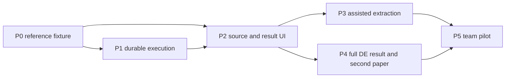

# Implementation backlog

> Design record from the planning phase. See [implemented behavior and evidence](IMPLEMENTED.md) and the [current operating guide](RUNBOOK.md) for delivered capabilities and remaining gates.

[Start](../README.md) · [Architecture](ARCHITECTURE.md) · [Evaluation](VERIFICATION.md) · [Operations and learning](OPERATIONS-LEARNING.md)

## Delivery strategy

Finish one usable loop before increasing scientific breadth. The first complete release is P0 through P2: **select Figure 1, review methods, run, compare, inspect a discrepancy, vary one filter, rerun and export**. Model assistance is P3. A polished interface without real artifacts and a command-line reproduction without review are both incomplete slices.

Dependency order:



The implementation may advance UI components using sealed fixtures while execution is being built, but its final acceptance requires live runs. No second platform, cloud account or paid model is a P0-P2 dependency.

Build a substantial, granular Git history throughout implementation. Follow the [commit plan](COMMIT-PLAN.md): each completed behavioral change, focused fix, meaningful test addition and design decision should have its own reviewable checkpoint. Do not accumulate entire phases into one commit. The planning task itself leaves files uncommitted.

## P0.1 Seal and reproduce the reference fixture

**Exact first implementation task:** create a versioned fixture and bounded R recipe for Law et al. v3 Figure 1, then execute it once and capture a verifiable artifact bundle. Do this before introducing FastAPI, agents or orchestration libraries.

Inputs are [the demo specification](DEMO.md) and [feasibility receipt](../evidence/feasibility.json). Proposed files to implement:

```text
fixtures/rnaseq123-v3-figure1/source-manifest.json
fixtures/rnaseq123-v3-figure1/sample-map.csv
fixtures/rnaseq123-v3-figure1/target.json
recipes/rnaseq123-density/recipe.json
recipes/rnaseq123-density/run.R
recipes/rnaseq123-density/upstream.patch
environments/rnaseq123-reference/Dockerfile
environments/rnaseq123-reference/locked-packages.json
tests/science/test_rnaseq123_reference.R
```

1. Verify the nine compressed/decompressed input hashes and exact sample selection against the receipt. Retrieve source material into an artifact cache outside tracked code; reject HTML challenge pages even when HTTP status is 200.
2. Acquire and inspect the version-3 paper PDF plus XML. Confirm DOI/version match, target Figure 1A/B, caption and method references. Record real PDF page/region coordinates only after visual inspection. The existing XML receipt does not supply them.
3. Review the upstream R chunks and seal original source plus an explicit minimal-adapter patch. Store the source license and dependencies. Define outputs for all selected observables and all failure states.
4. Attempt a fixed historical-package R environment using the package versions in DEMO. Resolve exact archive versions, digests and dependencies; bound build time/disk. Record actual architecture and the original platform difference. Do not use a mutable image tag as the final environment identity.
5. Execute without network after staging. Capture input/retained IDs, library totals, raw and filtered log-CPM summaries, density grids, cutoff, Figure 1 PNG, `sessionInfo()`, command, exit and timing.
6. Compare exact scalar checks, inspect the figure and mark unavailable paper-level numerical references. Execute a fresh same-environment run with cache disabled. Freeze the reference only after review; preserve its derivation rather than treating it as paper-supplied truth.

**Acceptance:** exact 27,179-by-9 input shape and all nine library totals; exact 5,153 all-zero rows; published retained count 16,624 or an explicit diagnosed mismatch; valid numerical output schemas; real source-aligned figure; fresh-rerun comparison; no output fabricated by a model; original source and every code/environment adaptation documented. A mismatch may be a scientifically useful record but does not satisfy a target of successful numerical reproduction.

**If blocked:** cap historical environment reconstruction at one bounded build strategy and one diagnosed correction. Preserve failure evidence and attempt the explicitly labeled modernized profile. If the modernized run recovers only part of the target, report partial completion and assess the Chen fallback. No silent tolerance changes, guessed package versions or substitution of a different figure. This task ends with a verified fixture or a concrete compatibility report, not weeks of framework scaffolding.

## Backlog and acceptance criteria

| ID | Work | Depends on | Acceptance |
|---|---|---|---|
| P0.2 | Add a sealed variation plan and reference comparison schema | P0.1 | CPM > 1 in at least three samples is the only scientific delta; both retained sets and parameter diff exported; known probe expectation 14,165 checked by real R |
| P0.3 | License/access ledger and fixture verifier | P0.1 | Every input has a URL, hash, size and access/rights state; missing or altered inputs fail closed; no raw data committed accidentally |
| P1.1 | FastAPI, PostgreSQL migrations, Pydantic records and generated TS contracts | P0 contracts | Workspace, source, plan, run and artifact CRUD obey FK/uniqueness constraints; unresolved plans cannot lock; generated client compiles |
| P1.2 | Immutable artifact store and safe collector | P1.1 | Interrupted promotion creates no successful dangling references; traversal, symlink, oversized and invalid-schema outputs rejected |
| P1.3 | Supervisor and durable job lifecycle | P1.1-2 | Duplicate submit creates one run; claim fencing prevents stale completion; real recipe runs in policy-constrained container; restart reconciles it |
| P1.4 | Cancellation, budgets and recovery | P1.3 | Cancel running R process and verify exit; unreachable daemon does not report cancelled; OOM/timeout/retry preserve evidence and resource accounting |
| P1.5 | Persisted events, logs and operational inspection | P1.3 | SSE reconnect recovers missing events without restarting work; bounded logs show truncation; state/attempt/receipt can be inspected without UI |
| P2.1 | Source viewer and method correction | P0.1, P1.1 | Correct paper version opens at verified target; fields link to passage/region; correction creates new revision; stale ETag edit rejected |
| P2.2 | Live run/result comparison | P1.3-5, P2.1 | Published and rerun figures, numerical deltas and limitations visible; browser refresh keeps run; complete execution and mismatch are distinguishable |
| P2.3 | Controlled variation and export | P0.2, P2.2 | One permitted change produces a new plan/run, preserves parent, shows all outcomes; exported bundle can rerun in a fresh local workspace |
| P2.4 | Usability and slice release gate | P2.3 | Keyboard-only path works; no color-only status; 1440px and 390px layouts usable; source-to-number path clear; end-to-end live demo passes |
| P3.1 | Single assistant for structured extraction | P2.4 | Optional provider works through broker; schema/evidence checks and usage caps enforced; manual entry still works offline |
| P3.2 | Evaluate extraction, alignment and corrections | P3.1 | Publish measured results against manual/lexical baseline; retain failure cases and confidence/coverage; no unsupported field auto-accepted |
| P3.3 | Optional independent method critic | P3.2 | Add only if held-out reduction in critical errors outweighs added review time/cost; same-budget comparison recorded |
| P4.1 | Full differential-expression result on primary data | P2.4 | Freeze design `~0+group+lane`, one contrast and FDR policy from source; emit full tested universe, effect sizes and adjusted p-values; retain all attempted variations |
| P4.2 | Second paper adapter | P4.1 | Different dataset; unsupported choices handled honestly; no special-case expected-answer logic; fresh environment run and source alignment |
| P4.3 | Reviewed analysis-code patches | P4.2, stronger sandbox | One patch at a time, original/altered provenance, independent execution checks, no access to comparator or private data; no automatic patch acceptance |
| P5.1 | Small authenticated team pilot | P3/P4 evidence, isolation tests | OIDC, roles, project-scoped storage/queries, audit, quotas, backup restoration and cross-workspace adversarial tests pass |
| P5.2 | Production durability and remote workers | Actual pilot need | Linux workers, reliable artifact storage and recovery drill; adopt Temporal only with a clear migration of scheduling ownership; no dual schedulers |

## Definition of the first usable release

A researcher can perform the complete P0-P2 flow without editing source code, rebuilding the application, manually querying SQL or paying for a model. They can inspect one live run's source and parameters, distinguish a mismatch from an execution failure, cancel and recover work, make the allowed variation and export evidence. The UI never invents progress percentages for unknown work. A static example is visibly a saved run.

Use a short recorded demonstration only after the live path works. Keep a saved example for offline viewing, but show a fresh run ID and fresh execution when claiming rerun consistency. Do not make the demo contingent on nondeterministic model behavior.

## Decisions deferred with explicit triggers

| Deferred capability | Revisit when |
|---|---|
| Hybrid/vector retrieval | Lexical/section baseline misses supported evidence on held-out papers |
| Nextflow/Snakemake integration | A selected workflow needs a real multi-step scientific DAG or existing pipeline |
| Temporal | Multiple remote workers/coordinators or long-lived workflows justify its operational cost |
| Arbitrary repositories | Curated recipes and strong execution isolation have passed adversarial tests |
| Collaborative simultaneous editing | Pilot shows meaningful concurrent review; start with revision conflicts, not CRDTs |
| Hypothesis generation | Reproduction, bounded robustness and independent held-out validation are dependable |
| Clinical evidence integration | Separate validated user demand justifies a distinct product decision |

Do not add Kubernetes, a vector database, multiple agent frameworks or automated paper writing to satisfy a technology checklist. Depth in execution correctness and scientific honesty is a stronger demonstration than feature count.
